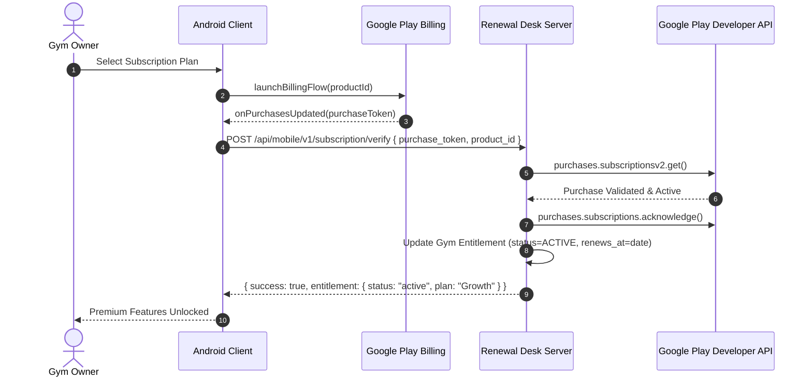

# RENEWAL DESK — ANDROID & SERVER BILLING ARCHITECTURE

## 1. Overview & Dual Billing Model
Renewal Desk operates a hybrid billing architecture supporting two acquisition and fulfillment models:
1. **Manual / Founder-Assisted Accounts (`billing_source = MANUAL`)**:
   - Accounts provisioned by administrators or enterprise founders.
   - Entitlements are managed server-side.
   - The Android client presents plan details, expiration date, and member capacity without rendering conflicting Google Play checkout flows.
2. **Self-Service / Store Accounts (`billing_source = GOOGLE_PLAY`)**:
   - Accounts registered through the mobile app or web portal requiring automated monthly recurring store subscriptions.
   - Enforces real Google Play Billing with server-side receipt validation.

---

## 2. Product Catalog & Tiers
Product identifiers are centrally defined and mapped across backend and Google Play Console:

| Tier Name | Target Segment | INR Monthly (India) | AED Monthly (UAE) | USD Monthly | Entitlements Included |
| :--- | :--- | :--- | :--- | :--- | :--- |
| **Starter** | Boutique / Micro Gyms (up to 150 members) | ₹999 | AED 99 | $19 | Member CRM, Renewal Tracking, Payment Recording |
| **Growth (Recommended)** | Standard Commercial Gyms (up to 500 members) | ₹1,499 | AED 199 | $39 | All Starter + WhatsApp Automated Reminders, Broadcast Announcements, Financial Reports |
| **Pro** | High-Volume Fitness Centers (Unlimited) | ₹2,499 | AED 299 | $59 | All Growth + 24/7 AI Receptionist, WhatsApp Lead Capture, Staff Takeover, Biometric Gate Commands |

---

## 3. Google Play Purchase & Verification Flow

---

## 4. Lifecycle Handling & RTDN Reconciliation
1. **Server-Side Truth**: Client callbacks alone never activate an account. Entitlement status is calculated on the server.
2. **Cancellation Grace**: When a user cancels their subscription in Google Play, the account remains `ACTIVE` until `expires_at`. Once `expires_at` passes without renewal, status transitions to `EXPIRED`.
3. **Payment Failure & Grace Period**: If payment fails, status transitions to `GRACE_PERIOD` (3-7 days based on store settings). If unrecovered, status becomes `PAYMENT_FAILED` then `EXPIRED`.
4. **Restore Purchases**: On app reinstall or device switch, querying existing purchases dispatches tokens to `/subscription/verify` to synchronize state without duplicate charges.
