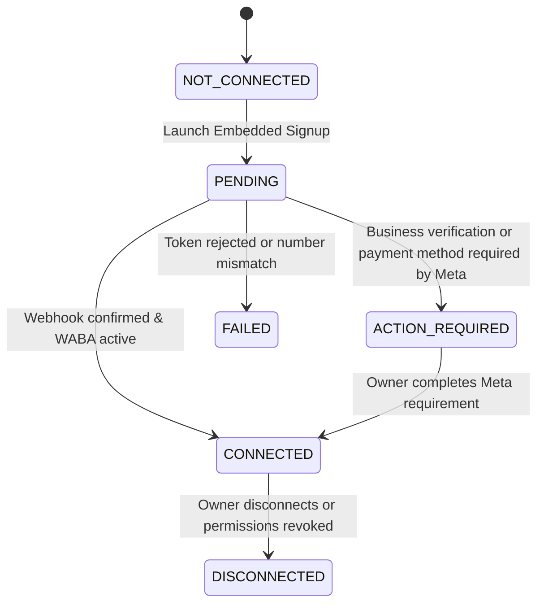

# META WHATSAPP EMBEDDED ONBOARDING & CLOUD API

## 1. Overview
Renewal Desk connects gym owners to the WhatsApp Business Platform via Meta Cloud API using the official Meta Embedded Signup architecture.

---

## 2. Onboarding Paths Supported

### Path A: Existing WhatsApp Business Number (Coexistence)
- For gym owners with an active WhatsApp Business App number on their mobile phone.
- Uses Meta's Cloud API Coexistence mode.
- Gym owner logs in via Facebook login dialog, grants WABA permissions, and associates the phone number with Renewal Desk Cloud API while continuing normal manual chat in their mobile app.

### Path B: Dedicated Automation / New Number
- For gyms wanting a distinct WhatsApp automation number.
- Verified via standard SMS/Voice OTP during Embedded Signup.
- Managed completely by Renewal Desk's AI Receptionist and automated reminder worker.

---

## 3. Connection State Machine

---

## 4. Truthful Status Contract
The Android app reflects one of the following states:
- `NOT_CONNECTED`: No WABA configured.
- `PENDING`: Waiting for Meta webhook registration / token handshake.
- `ACTION_REQUIRED`: Meta requires business manager verification.
- `CONNECTED`: Automated reminders and AI receptionist active.
- `FAILED`: Meta API error or token invalidation.
